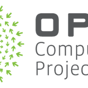

Getting Started with Open Compute Project (OCP) Github
===================
OCP welcomes all members to join this open source community and contribute to any OCP project.

Step-1
-------------

1. Please get familiar with our Governance Document [Governance Document]( https://www.opencompute.org/documents/amended-governance-for-reference-only) (specifically the section on Software Projects starting on Pg 16).  

2.  Members are encouraged to follow the OCP **Code of Conduct** in this [document](https://github.com/opencomputeproject/OCP-Software-GitHib-Process/blob/master/Code%20of%20conduct.md) and agree. 
Members are welcome to join the mailing list for the respective project and start attending & contributing to the weekly discussion on the ongoing activities to contribute. [Project and Sub-Project Group](https://www.opencompute.org/projects) mailing lists can be subscribed from their respective project pages.

3. Members shall go through to the Project/Sub-Project page and familiarize themselves with the charter, the wiki and current activity within the community.

4. Members shall go through to the Project/Sub-Project page and familiarize themselves with the charter, the wiki and current activity within the community.

5. Members shall familiarize themselves with the OCP Software Development Process. Please click [here](https://github.com/opencomputeproject/OCP-Software-GitHib-Process/blob/master/OCP%20Software%20GitHub%20Process.md) more more information.
