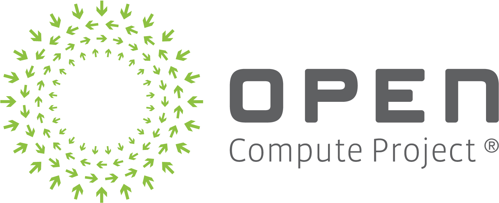

Getting Started with Open Compute Project (OCP) Github
===================
OCP welcomes all members to join this open source community and contribute to any OCP project.

### Step-1

1. Please get familiar with our Governance Document [Governance Document] (https://www.opencompute.org/documents/amended-governance-updated-september-18th-2020) (specifically the section on Software Projects starting on Pg 16).  

2.  Members are encouraged to follow the OCP **Code of Conduct** in this [document](https://github.com/opencomputeproject/OCP-Software-GitHub-Process/blob/master/Code%20of%20conduct.md) and agree. 
Members are welcome to join the mailing list for the respective project and start attending & contributing to the weekly discussion on the ongoing activities to contribute. [Project and Sub-Project Group](https://www.opencompute.org/projects) mailing lists can be subscribed from their respective project pages.

3. Members shall go through to the Project/Sub-Project page and familiarize themselves with the charter, the wiki and current activity within the community.

4. Members shall go through to the Project/Sub-Project page and familiarize themselves with the charter, the wiki and current activity within the community.

### Step-2
Fill in the required information.

-   Complete the [Scope.md](https://github.com/opencomputeproject/OCP-Software-GitHub-Process/blob/master/Scope.md) file, which determines the scope of your Working Group and its patent coverage.
    
-   Modify [Notices.md](https://github.com/opencomputeproject/OCP-Software-GitHub-Process/blob/master/Notices.md) to add contact(s) for code of conduct issues.
    
-   [License.md](https://github.com/opencomputeproject/OCP-Software-GitHub-Process/blob/master/License.md) must list the type of OSI license selected for the source code that is included in the specification. The default license is MIT, and you may change that to an open source license of your choosing.

## Legal
Please see legal information [here](legal/index.md) 
> **Note:** This section also covers the process and signing of **CLA**.

## Software Contributions
Please see software contributions information [here](software_contributions/index.md)
> **Note:** Detailed information can also be gathered from the [OCP Software governance] (https://www.opencompute.org/documents/amended-governance-updated-september-18th-2020) document (starting pg-16).

